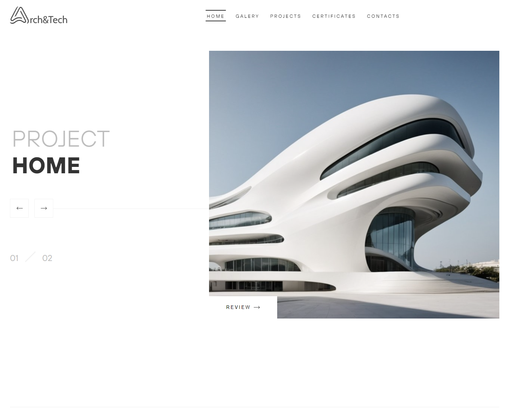

# Project Home

A simple page layout from a Figma mockup, using HTML, CSS(SCSS), JavaScript, Sweetalert2 for window modals and AOS-library for animation.

## Preview

Link to preview:https://project-home-rho.vercel.app/

## Features

- Form validation
- Smooth scrolling
- Animation on scrolling
- Adaptive styles for laptop and mobile screens
- Styles components on hover and active state
- Basic Webpack configuration
